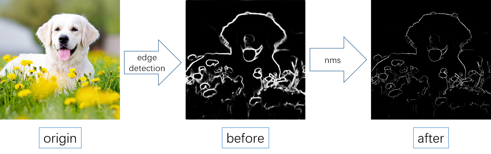

# nonmax
**nonmax**: non-maximum suppress

## Perform nms on detected edge map:


## Howto
Firstly compile the mex excutives with `compile.m`.

Then apply nms to the detected heatmap:
```matlab
image = imread('dog.png');
edge = some_edge_detection_algorithm(image);
edge_nms = nms(edge);
```

That's all, enjoy.
